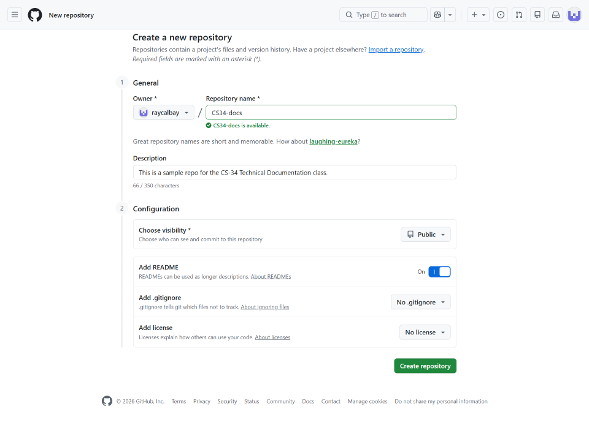

# Toolset Guide

Follow these steps to set up your local development environment and connect your projects to GitHub.

## Prerequisites

Before starting, make sure you have the necessary software and accounts ready.

### Download tools

* **Visual Studio Code:** [https://code.visualstudio.com/download](https://code.visualstudio.com/download)
* **Git:** [https://git-scm.com/install/](https://git-scm.com/install/)


### Setup GitHub

* **Account:** Sign up at [GitHub.com](https://github.com/).
* **Repository:** Create a new repository on GitHub for your coursework. Reference the options in the screenshot. 

    

>> Note: Make sure to copy the `HTTPS URL` of the repo. You will need this when you clone locally.

---

## Local workspace setup

Create a dedicated folder to keep your docs/code organized.

1. Open **Windows Explorer** and navigate to `C:\`.
2. Create a new folder and name it `GIT`.

---

## Install VS Code Extensions

We will use **Git Graph** to help visualize your branches and commits.

1. Open **VS Code**.
2. Click the **Extensions** icon on the left sidebar (or press `Ctrl+Shift+X`).
3. Search for **Git Graph**.
4. Select **Install**. If prompted, select **Trust Publisher**.

---

## Clone your repository

This step downloads your GitHub project to your local `C:\GIT` folder.

1. In VS Code, open a **Git Bash** terminal (`Terminal` > `New Terminal`).

    >> Note: Ensure the dropdown in the terminal panel says "Git Bash" and not "PowerShell".*

2. Navigate to your GIT folder by typing:

   ```
   cd /c/GIT
    ```
3. Clone your repository:
    ```
    git clone [your-repo-URL]
    ```
4. Open the folder in VS Code (File > Open Folder > navigate to your repo).

---

## Publish

### Publish the main branch

You must commit a file to "activate" the main branch on GitHub.

1. Create a new file named `README.md` in your folder.
2. In the terminal, run:
    ```
    git add .
    git commit -m "Initial commit: Setup main branch"
    git push origin main
    ```

>> Note: If you are prompted to set your Git identity, run the following commands.
    ```
    git config --global user.name [Your name]
    git config --global user.email [Your email address]
    ```

### Push a commit to the main branch

1. Open the repo folder in VS Code. Go to `File > Open Folder`, navigate to `C:\GIT`, and select your repository folder. 

2. When prompted, click `Yes, I trust the authors`.

3. Make your initial changes. 

4. Go to the Source Control tab. Hover on **Changes** and click the `+` icon to stage all changes.

5. Type a commit message, and then click `Commit` and then `Push`.

### Publish to GitHub pages

1. In github.com, open your repo and click `Settings`. 

2. From the left panel, select `Pages`. 

3. Under `Source`, select `Deploy from a branch`.

4. Under `Branch`, select `main`. 

Once your repo has built and your site is live, you will its complete URL in `Settings`.